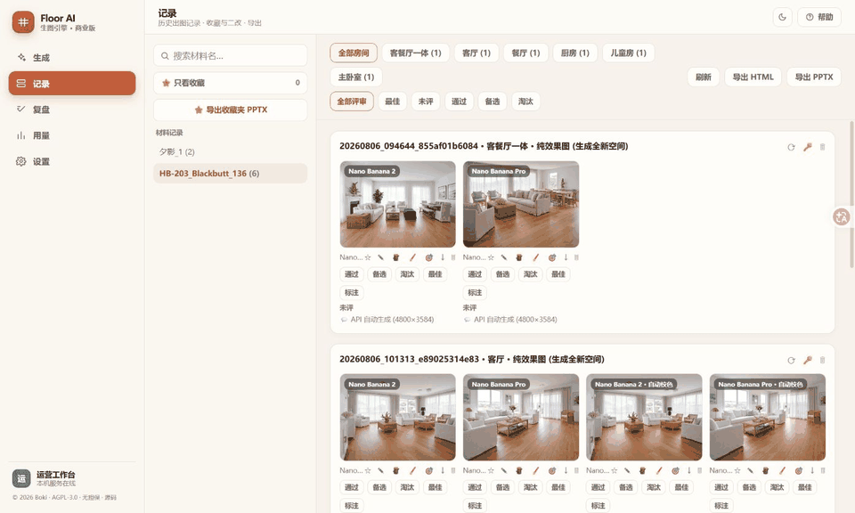
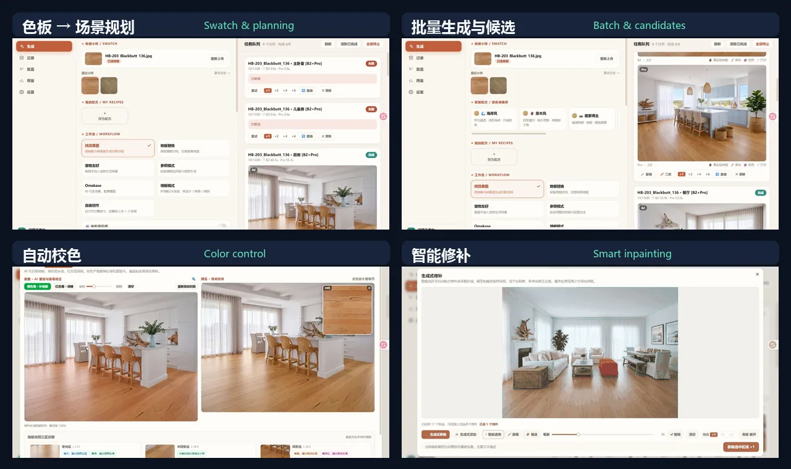

# Floor Rendering Engine


Turn a real flooring swatch into spatial content that can be batch-generated, color-locked, locally repaired, reviewed, and delivered.

This is not a “home interior” prompt preset. It asks whether the product color is accurate, how much of the frame the floor occupies, whether the space feels believable, how a failed output can be repaired, and whether a marketing team can publish the result.

> The goal is not to make AI generate more images. It is to move a real product reliably into publishable content.

[中文](./README.md) · [Product case study](./docs/PRODUCT_CASE_STUDY.en.md) · [Live demo](https://www.bokiframe.com) · [Developer guide](./DEVGUIDE.md)



## What's New in 2026.08

- **A redesigned production workspace:** Product → Scene → Output replaces the long parameter column. Core room, style, lighting, and camera controls stay close at hand, while B2 / Pro tabs, candidate thumbnails, and pass / alternative / reject / favorite actions now live directly on result cards.
- **Color matching 2.0 + a standalone utility:** Match a newly photographed large sample to an older small swatch without starting Floor Engine or calling an AI service. Beyond classic LAB statistics, it now offers reliable-pixel filtering, detailed distribution transfer, optional spatial illumination correction, and a 0–100 confidence report with a four-color diagnostic overlay. Classic mode remains the default and preserves the new image's texture and natural lighting.

> **Bring new and historical sample photography back to one product-color baseline.** Launch it directly on Windows or run it independently on Linux: [try the standalone sample color matcher](./standalone_color_calibrator/README.md).

## Why

The old workflow was never just “write a prompt.” A social media specialist had to understand the swatch, imagine a space, choose a camera, iterate on prompts, search through many candidates, then repair color drift and local defects.

Five images typically took about one hour. Roughly one image was selected from every ten outputs. The real cost was not the API call itself, but the judgment, retries, and post-processing around it.

Floor Rendering Engine turns that invisible manual process into executable product rules with explicit fallbacks:

```text
swatch recognition
-> scene and cinematic planning
-> multi-model batch generation
-> floor segmentation and color locking
-> AI selection and generative repair
-> review, learning, and delivery
```

## What It Does

One production job can run B2, Pro, and SD routes together, retain both API originals and processed candidates, and attach scene parameters, model route, timing, review status, and issue tags to one record.

The current production workspace supports:

- A Product → Scene → Output accordion that keeps core controls visible and expands secondary parameters only when needed;
- Swatch-aware tone detection and flooring-specific scene recipes;
- Batch generation across rooms or products, with independent model concurrency;
- A Cinematic Realism switch that plans believable camera positions, action, eye lines, and practical light before B2 / Pro generation;
- A dual-thumb floor-coverage control from **10–80%**, defaulting to **40–50%**, committed only when the drag ends;
- Local MobileSAM segmentation for floors, objects, and receiving surfaces, with brush refinement;
- Offline matching of newly photographed large samples to historical swatches while retaining resolution, texture, and lighting;
- B2 / Pro tabs and candidate thumbnails with pass / alternative / reject / favorite actions directly on result cards; the records workspace retains issue tags and HTML / PPTX delivery exports.

## Product Gallery

### Swatch → planning → production

The generation page is not a giant prompt box. Product, scene, and output are organized as a three-step accordion: room, style, light, and camera stay in the core layer while region, material, and floor coverage expand on demand. The result workspace uses model tabs and candidate thumbnails for live review.



### Color-locked output

Image models routinely shift flooring color. The system segments the floor and moves the result toward the swatch target in LAB space. The correction remains inside the mask to preserve walls, furniture, and ambient light as much as possible.


### Match a newly photographed large sample to an older swatch

The repository includes a [standalone sample color matcher](./standalone_color_calibrator/README.md) that runs without the main application. Select a material region in the new large photograph, use the historical small swatch as the reference, and apply a deterministic correction across the full-resolution image. Classic mode transfers LAB chroma while preserving grain, embossing, bevels, highlights, and shadows. Detailed mode handles skewed or multimodal color distributions, while optional spatial correction can remove a large-area color cast or align color and luminance together.

Analysis rejects glare, clipped pixels, deep local shadows, and off-material outliers. It reports a 0–100 confidence score, estimated CIEDE2000 difference, gamut risk, and a four-color pixel overlay; low confidence warns without blocking export. Design, catalog, e-commerce, and social teams can therefore produce more consistent source assets without starting the generation stack. Processing stays local, images are not uploaded, and no model API cost is incurred.

### Click an object, then refine the mask

Removal mode scans for separable objects in the background. Addition mode identifies a receiving floor, wall, or tabletop from a click. AI selection, brush inclusion, and eraser exclusion are composed into one editable mask.


### Review is part of generation

Outputs do not disappear into a downloads folder. API originals, color-matched images, repaired versions, and model candidates remain on the same record, where the team can filter rooms, pick the best result, learn from failures, and export proposals.


## Core Product Rules

### 1. Product color is a constraint

Flooring is not a generic scene material. Prompts, references, automatic color matching, and local editing all protect the swatch. Post-processing may only change the explicitly segmented floor region.

### 2. Composition is controllable

Floor coverage is no longer hard-coded inside prompt prose. `floor_coverage_min` / `floor_coverage_max` flow from the dual slider through Gemini, cinematic planning, and SD prompt pipelines. The backend validates the range and guarantees that minimum does not exceed maximum.

Cinematic Realism is not a `cinematic` keyword append. It reasons about camera position, human or pet action, eye lines, and practical light. If planning fails, a local fallback direction is used without blocking paid generation.

### 3. AI proposes; the user decides

MobileSAM can propose a floor mask, object candidates, and point regions, but it never makes an irreversible decision. Brush, eraser, undo, and clear remain available. If the model is unavailable, manual editing still works.

### 4. Batch is the default unit

A production team needs a useful set, not one impressive call. Multi-model queues, room batches, multi-swatch batches, cancel, retry, redraw, and recovery are part of the primary workflow.

### 5. Every output remains traceable

API originals, automatic color matching, local edits, generation parameters, providers, timing, and human review form one result lineage. Strong results can be reused; failed results can become the next product rule.

## Production Evidence

These are internal production observations, not offline benchmarks:

- Approximately **10** internal users;
- Nearly **2,000 images** generated;
- The old process took about **1 hour per 5 images**; jobs can now be submitted in batches, so minimum throughput is primarily bounded by upstream API speed;
- The old usable-image rate was roughly **1 selected from 10 outputs**; most standard images are now usable on the first round, while special cases average a useful result within about **2 outputs**;
- Including API retries, ideation, prompt writing, and post-processing, total production cost is internally estimated to be about **80% lower**;
- Monthly team reporting observed approximately **4% Pinterest like-to-order conversion**.

<sub>The Pinterest metric is a team-level operating observation affected by content, media, product, and channel factors. It is not attributed solely to this system.</sub>

<details>
<summary><strong>How AI smart selection works</strong></summary>

1. **Local encoding:** the longest edge is resized to 1280 px before MobileSAM ONNX inference. Embeddings and the three most recent full scans use LRU caches. Segmentation never leaves the machine.
2. **Candidate discovery:** removal mode applies multi-scale point prompts over an `8 × 6` grid, filters by confidence, stability, and area, keeps the connected component containing the prompt, and de-duplicates by IoU / containment. At most 24 contours are returned.
3. **Click priority:** a miss—or a click before background scanning finishes—immediately starts point segmentation. The full scan releases its inference lock between grid points, so explicit clicks do not wait for the entire scan.
4. **Editable composition:** AI regions are unioned, brush additions are applied, and eraser exclusions are subtracted before exporting a binary PNG mask. Inference and feathered blend masks remain separate, preserving pixels outside the edit region.
5. **Controlled fallback:** reflective, transparent, or occluded edges may be incomplete. The UI explains the state and keeps manual editing available. Smart segmentation adds no third-party segmentation API cost.

See the [developer guide's smart-selection data flow](./DEVGUIDE.md#56-生成式修补智能选区数据流) (Chinese) for implementation detail.

</details>

## Engineering

```text
Next.js 16 / React 19
        | HTTP + SSE
FastAPI / task orchestration / queue recovery
        |-- Gemini / Fal / ComfyUI
        |-- MobileSAM / OpenCV / LAB
        `-- records / review / usage / export
```

- B2, Pro, and SD use independent concurrency slots. The service binds to `127.0.0.1` by default.
- Configuration, outputs, logs, and queue recovery state remain in the local data directory.
- Regression coverage includes prompt snapshots, route contracts, path security, queue recovery, cinematic planning, floor coverage, color matching, standalone sample matching, smart selection, and record lineage. This release is verified at **220 tests passed**.

## My Role

I independently owned the core product from problem definition to engineering delivery:

- Observed the social media workflow and reframed “generate beautiful images” as speed, usable-image rate, brand-color consistency, and deliverability;
- Designed the journey from swatch and scene through generation, color correction, repair, review, and export;
- Selected and integrated Gemini, Fal, MobileSAM, OpenCV, and local/cloud fallback paths;
- Built the FastAPI + Next.js product, orchestration, persistence, usage reporting, and one-click Windows startup;
- Turned real user feedback into browser reproduction, concurrency analysis, interaction fixes, and regression coverage.

The [full product case study](./docs/PRODUCT_CASE_STUDY.en.md) covers context, tradeoffs, measurement definitions, and responsibility boundaries.

## Quick Start

Requirements: Python 3.10+, Node.js 20+, and at least one configured image-model API — either [Google AI Studio](https://aistudio.google.com/) (Gemini) or [fal.ai](https://fal.ai/) is enough; a self-hosted ComfyUI instance is also supported with zero API cost. The MobileSAM model asset is included.

### If you only need sample color matching

On Windows, double-click [`standalone_color_calibrator/启动校色工具.bat`](./standalone_color_calibrator/启动校色工具.bat), then load the new large photograph and the older reference swatch. The utility only needs Pillow, NumPy, and OpenCV—no Node.js, API key, or Floor Engine service. It also has a command-line interface:

```powershell
python standalone_color_calibrator/app.py --source new-large.jpg --reference old-swatch.jpg --output matched.jpg
```

See the [standalone color matcher guide](./standalone_color_calibrator/README.md) for the GUI workflow, selection advice, and all options.

### Windows

```text
Install_Project_Dependencies.bat   # first-time setup
start-windows.bat                  # http://127.0.0.1:7870
dev-windows.bat                    # FastAPI 7870 + Next.js 3000
```

`start-windows.bat` checks whether frontend source files are newer than `web/out`. It rebuilds only when output is missing or stale, preventing an old UI without reinstalling dependencies on every launch.

### Linux / macOS

```bash
python -m venv .venv
source .venv/bin/activate
pip install -r requirements.txt
cd web && npm ci && npm run build && cd ..
python serve.py
```

Enter API keys on the Settings page after first launch. See [DEVGUIDE.md](./DEVGUIDE.md) for ports, configuration, and module details.

## Repository Guide

- [Product case study (English)](./docs/PRODUCT_CASE_STUDY.en.md) / [产品案例（中文）](./docs/PRODUCT_CASE_STUDY.zh-CN.md)
- [Developer guide](./DEVGUIDE.md)
- [Development log](./开发日志.md) (Chinese)
- [Standalone sample color matcher](./standalone_color_calibrator/README.md)
- [SaaS architecture roadmap](./SAAS_ARCHITECTURE.md)
- [Third-party notices](./THIRD_PARTY_NOTICES.md)
- [Commercial licensing](./COMMERCIAL_LICENSING.md)

## Security And License

`engine_config.json`, `data/`, generated outputs, and logs are ignored. A multi-user or public deployment requires authentication, tenant isolation, object storage, and production job scheduling first.

Original code is licensed under [GNU AGPL-3.0-only](./LICENSE). See [commercial licensing](./COMMERCIAL_LICENSING.md) for closed-source commercial use. Third-party models and components retain their own licenses.

## Design Principle

A useful AI product is not defined by one impressive result.

It places the right product constraints before generation and preserves human judgment after generation.
