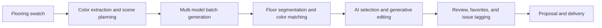
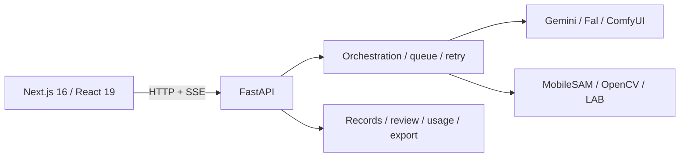

<div align="center">
  

  # Floor Rendering Engine

  **An AI visual production system for flooring marketing teams**

  It turns product swatches, spatial ideation, and prompt engineering into a batchable, color-locked, editable, and reviewable workflow.

  [中文](./README.md) · [Product case study](./docs/PRODUCT_CASE_STUDY.en.md) · [Live demo](https://bokiframe.com) · [Developer guide](./DEVGUIDE.md)

  [](./LICENSE)
  [](https://www.python.org/)
  [](./web)
  [](./server_api.py)
</div>

<p align="center">
  
</p>

> This is a production tool used by a real corporate social media team—not a model API demo. I independently owned the core product design and engineering. Company and customer information shown here is anonymized.

## Business impact

| Metric | Before | Current outcome |
|---|---|---|
| Adoption | Fragmented manual workflow | Used by approximately **10** social media team members |
| Production speed | About **1 hour per 5 images**, including ideation, prompting, and post-processing | Direct batch generation; throughput is now primarily bounded by upstream API speed |
| Usable-image rate | Roughly **1 selected from every 10 outputs** | Most standard images are usable on the first round; special cases average a usable result within about **2 outputs** |
| Total production cost | Repeated generation plus manual trial and error | Approximately **80% lower**, based on an internal estimate |
| Production scale | — | Nearly **2,000 images** generated |
| Downstream observation | — | Internal monthly team reporting shows approximately **4% Pinterest like-to-order conversion** |

<sub>Measurement note: the cost estimate includes API retries, ideation, prompt writing, and post-processing time. Pinterest conversion is a team-level operating result influenced by content, media, product, and channel factors; it is not attributed solely to this system.</sub>

## From image generation to content delivery

General-purpose image tools optimize a single generation. A production team needs a consistent, controllable, and reviewable loop.




## Core product capabilities

| Stage | Capabilities | Product value |
|---|---|---|
| Planning | Swatch color extraction, domain parameters, AI scene copilot, cinematic direction | Reduces spatial ideation and prompting overhead |
| Production | B2 / Pro / SD routes, batch candidates, concurrent queues, retries | Turns manual calls into a repeatable production line |
| Quality | MobileSAM floor segmentation, LAB color matching, AI smart selection, generative add/remove | Protects product color and fixes local defects quickly |
| Operations | Record lineage, pass/alternative/reject, issue tags, cost tracking, HTML/PPTX export | Enables team review, reuse, and delivery instead of scattered downloads |

### Brand color is a system constraint

Generative models often shift the flooring color. The system first segments the floor with MobileSAM, then moves the result toward the swatch target in LAB color space while limiting edits to the mask, preserving walls, furniture, and ambient light as much as possible.


### AI selection works with—not against—the brush

Generative removal first scans for separable objects so a user can select one with a click. Generative addition uses the clicked point to identify a receiving surface such as a floor, wall, or tabletop. Brush, eraser, undo, and clear remain available for shadows, edge corrections, and fallback.


<details>
<summary><strong>How AI smart selection works</strong></summary>

1. **Local encoding:** the longest image edge is resized to 1280 px before MobileSAM ONNX inference. Embeddings and the three most recent full-image scans use LRU caches. Segmentation stays local and adds no third-party segmentation API cost.
2. **Candidate discovery:** removal mode applies multi-scale point prompts over an `8 × 6` grid. It filters by confidence, stability, and area, keeps the connected component containing the prompt, and de-duplicates at IoU ≥ 0.80 or containment ≥ 0.92. At most 24 clickable contours are returned.
3. **Click priority:** clicking an existing contour toggles it immediately. A miss—or a click during background scanning—starts point segmentation. The scan releases its inference lock between grid points, allowing explicit clicks to run first before results are merged.
4. **Editable composition:** selected AI regions are unioned, brush additions are applied, and eraser exclusions are subtracted before exporting a binary PNG mask. The backend produces separate inference and feathered blend masks, preserving pixels outside the edit region.
5. **Controlled fallback:** if MobileSAM cannot find a stable area or misses reflective, transparent, or occluded edges, the UI explains the state and keeps manual editing available. The mask constrains scope; final content quality still depends on the selected inpainting model.

See the [developer guide's smart-selection data flow](./DEVGUIDE.md#56-生成式修补智能选区数据流) for implementation detail.

</details>

## My role

I independently owned the core work from problem definition to a production-ready system:

- Observed the social content workflow and reframed “generate beautiful images” into measurable goals for speed, usable-image rate, brand color consistency, and delivery;
- Designed the end-to-end journey from swatch and scene through generation, color correction, editing, review, and export;
- Selected and integrated Gemini, Fal, MobileSAM, and OpenCV while retaining user control and failure fallbacks;
- Built the FastAPI + Next.js application, orchestration, persistence, usage reporting, and one-click Windows startup;
- Turned real feedback such as “clicking does nothing” into a reproducible concurrency issue, responsive UI feedback, and regression coverage.

The [full product case study](./docs/PRODUCT_CASE_STUDY.en.md) covers the context, decisions, measurement definitions, and iteration history.

## Product decisions

- **Automation vs. control:** AI proposes regions but does not make irreversible choices; every AI mask remains manually editable.
- **Quality vs. throughput:** model routes have independent concurrency. Standard work favors batch speed; hard cases can escalate to a stronger model or local edit.
- **Brand consistency vs. natural scenes:** LAB correction is limited to the floor mask, with separate inference and blend masks.
- **Capability vs. reliability:** queues, retries, provider handles, and records persist; a missing model degrades to a still-usable base path.

## Architecture



- The frontend owns interaction while FastAPI owns business state; B2, Pro, and SD routes have independent concurrency slots.
- The service binds to `127.0.0.1` by default, with outputs, configuration, and logs kept in the local data directory.
- Backend regression coverage includes prompt snapshots, route contracts, path security, queue recovery, color matching, smart selection, records, and exports.

## Quick start

Requirements: Python 3.10+, Node.js 20+, and at least one configured image-model API. The MobileSAM asset is included.

### Windows

```text
start-windows.bat    # built single-port app at http://127.0.0.1:7870
dev-windows.bat      # FastAPI 7870 + Next.js 3000
```

### Linux / macOS

```bash
python -m venv .venv
source .venv/bin/activate
pip install -r requirements.txt
cd web && npm ci && npm run build && cd ..
python serve.py
```

Enter API keys on the Settings page after first launch. See [DEVGUIDE.md](./DEVGUIDE.md) for ports, configuration, and development workflows.

## Documentation

- [Product case study (English)](./docs/PRODUCT_CASE_STUDY.en.md) / [产品案例（中文）](./docs/PRODUCT_CASE_STUDY.zh-CN.md)
- [Developer guide](./DEVGUIDE.md)
- [SaaS architecture roadmap](./SAAS_ARCHITECTURE.md)
- [Third-party notices](./THIRD_PARTY_NOTICES.md)
- [Commercial licensing](./COMMERCIAL_LICENSING.md)

## Security and license

`engine_config.json`, `data/`, outputs, and logs are ignored. Never publish API keys in issues, screenshots, or logs. A multi-user or public deployment requires authentication, tenant isolation, object storage, and production job scheduling first.

Original code is licensed under [GNU AGPL-3.0-only](./LICENSE). See [commercial licensing](./COMMERCIAL_LICENSING.md) for closed-source commercial use. Third-party models and components retain their own licenses.
