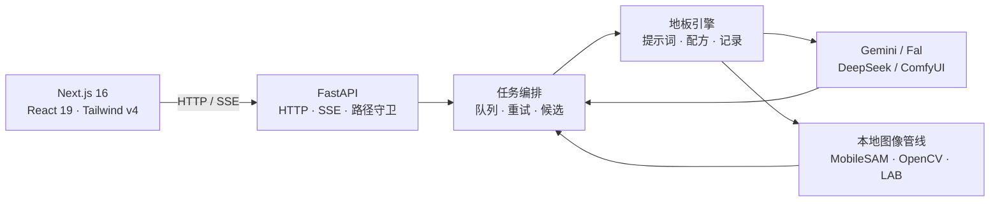

<div align="center">
  

  # Floor Rendering Engine

  **为地板行业打造的 AI 空间效果图生产工作台**

  从地板小样出发，完成识色、场景规划、电影感生图、自动校色、评审与提案导出。

  [](./LICENSE)
  [](https://www.python.org/)
  [](./web)
  [](./server_api.py)
  [](#快速开始)

  [在线展示](https://bokiframe.com) ·
  [快速开始](#快速开始) ·
  [开发文档](./DEVGUIDE.md) ·
  [提交问题](https://github.com/Bok1-YY/Floor_rendering_engine/issues)
</div>

---

## 它解决什么问题

通用生图工具擅长“生成一张漂亮图片”，但地板业务真正关心的是另一组问题：

- 小样颜色能不能准确进入场景，而不是被模型随意改色？
- 板型、铺法、倒角、缝隙和光泽能不能稳定表达？
- 替换地板时，原房间结构、家具和光影能不能保留？
- 人物或宠物入镜时，画面能不能更真实、更像电影而不是摆拍或 CG？
- API 返回的原图、校色版本、评审结论和客户提案能不能形成完整记录？

Floor Rendering Engine 把这些步骤做成一条面向地板行业的生产管线，而不是在通用聊天框里反复手写提示词。

```text
地板小样
   ↓  自动识色 / 配方推荐
场景与材质参数
   ↓  电影感导演规划 / 多模型生成
API 原图
   ↓  MobileSAM 地板分割 / LAB 自动校色
交付候选
   ↓  评审 / 收藏 / 复用 / PPTX
客户提案
```

## 核心能力

| 能力 | 说明 |
|---|---|
| **行业化提示词引擎** | 将房型、市场、风格、灯光、机位、铺法、尺寸、光泽和避让项编译为稳定的英文生图指令。 |
| **多工作流** | 支持纯效果图、地板替换、参照模式、宠物友好、Omakase、墙板模式和自由创作。 |
| **电影真实感规划** | 在正式生图前规划可信机位、现实光源、主体动作与视线关系，改善人物和宠物的摆拍感、塑料感与 CG 感。 |
| **B2 / Pro 双模型** | B2 用于快速探索，Pro 用于高质量交付；可并行运行，也可追加 SD 3.5 实验线路。 |
| **自动地板校色** | B2 / Pro 出图后，用离线 MobileSAM 识别地板区域，只校正蒙版内色度并保留明暗。 |
| **API 原图双版本保留** | 自动校色图作为当前结果，同时在队列、候选和历史记录中保留未经处理的 API 原图。 |
| **局部修补与二改** | 支持生成式移除、实验性添加、磨缝、二次编辑、重抽，以及正负画笔修正地板蒙版。 |
| **生产记录闭环** | 保存生成参数、候选图和来源关系；支持收藏、最佳图、通过/备选/淘汰评审、HTML 与 PPTX 导出。 |
| **异步任务队列** | 生图请求秒回 `job_id`，通过 SSE 展示阶段进度；长耗时 4K 任务不阻塞界面。 |
| **线路与成本治理** | Google / Fal 路由、失败自动切线、FAL 持久队列、用量统计和按模型成本估算。 |

## 工作流

| 工作流 | 主要输入 | 适用场景 |
|---|---|---|
| **纯效果图** | 地板小样 + 场景参数 | 从零生成完整空间 |
| **地板替换** | 地板小样 + 房间原图 | 保留房间，只替换地面 |
| **参照模式** | 地板小样 + 风格参照图 | 复用参照图的空间语言与氛围 |
| **宠物友好** | 地板小样 + 宠物设定 | 生成自然、可信的宠物生活场景 |
| **Omakase** | 地板小样 + 简短创意 | 由 AI 完成场景散文与电影感规划 |
| **墙板模式** | 木纹小样 + 可选场景图 | 墙板再设计、替换或原创 |
| **自由创作** | 完整指令 + 1–3 张有序参考图 | 绕过地板模板，直接控制模型 |

> 自动校色只应用于 B2 / Pro 的地板类工作流。墙板、自由创作、SD 3.5、Lite 预览、二改和磨缝不会被自动处理。分割或校色失败时任务仍然成功，并安全保留 API 原图。

## 快速开始

### 环境要求

- Python 3.10+，推荐 Python 3.12
- Node.js 20.9+
- Google Gemini API Key
- 可选：Fal API Key、DeepSeek API Key、ComfyUI

主生图线路使用云端 API，不要求本机具备高端显卡；MobileSAM 校色分割在本地通过 ONNX Runtime 运行。

### Windows

```powershell
git clone https://github.com/Bok1-YY/Floor_rendering_engine.git
cd Floor_rendering_engine

py -3.12 -m venv .venv
.\.venv\Scripts\python.exe -m pip install -r requirements.txt

cd web
npm ci
npm run build
cd ..

.\start-windows.bat
```

浏览器将打开 <http://127.0.0.1:7870>。首次使用时，在「设置」页填写 Gemini API Key。

开发模式使用：

```powershell
.\.venv\Scripts\python.exe -m pip install -r requirements-dev.txt
.\dev-windows.bat
```

前端开发服务器位于 <http://localhost:3000>，FastAPI 位于 <http://127.0.0.1:7870>。

### Linux / macOS

```bash
git clone https://github.com/Bok1-YY/Floor_rendering_engine.git
cd Floor_rendering_engine

python3 -m venv .venv
source .venv/bin/activate
python -m pip install -r requirements.txt

cd web
npm ci
npm run build
cd ..

FLOOR_DATA_DIR="$PWD/data" python serve.py
```

健康检查：

```text
GET http://127.0.0.1:7870/api/healthz
```

成功时返回 `{"ok": true}`。FastAPI 接口文档位于 <http://127.0.0.1:7870/docs>。

## 从小样到交付

1. 上传地板小样，系统识别主色调并推荐场景配方。
2. 选择工作流、模型和场景参数；人物或宠物场景可启用电影真实感。
3. B2 / Pro 并行生成，任务卡通过 SSE 显示实时阶段。
4. 地板类结果自动完成局部校色，校色图成为当前图，API 原图仍可随时打开。
5. 使用重抽、磨缝、二改、局部修补或手工蒙版继续优化。
6. 将满意结果收藏或标为最佳图，在记录页复用参数、完成评审并导出提案。

## 模型与提供方

| 模块 | 默认/可选线路 | 用途 |
|---|---|---|
| **Nano Banana 2** | Google Gemini / Fal | 快速探索与批量出图 |
| **Nano Banana Pro** | Google Gemini / Fal | 高质量交付 |
| **Nano Banana Lite** | Google Gemini | 1K 快速预览，不进入正式队列 |
| **SD 3.5 Large** | Fal + IP-Adapter | 实验性地板参考生成，可接 AuraSR |
| **Omakase / 电影规划** | Gemini，DeepSeek 可备用 | 场景文本与导演规划 |
| **生成式修补** | Fal 或自备 ComfyUI | 移除、添加和局部重绘 |
| **地板分割与校色** | 本地 MobileSAM + OpenCV | 不增加生图 API 调用 |

> 云模型的可用性、计费和内容政策由对应提供方决定。启用自动切线前，请先配置相应提供方的 Key。

## 配置与数据

推荐在前端「设置」页管理配置。密钥和运行数据不会提交到 Git：

| 路径 | 内容 |
|---|---|
| `data/engine_config.json` | API Key、线路、并发、代理与功能开关 |
| `data/output_files/` | API 原图、校色图、候选图和记录 JSON |
| `data/_ng_uploads/` | 上传素材与品牌 Logo |
| `data/_ng_thumbs/` | 缩略图缓存 |
| `data/app_local_save.log` | 运行日志 |

Windows 启动脚本会自动把 `FLOOR_DATA_DIR` 指向项目内的 `data/`。手动启动时建议显式设置同名环境变量。

<details>
<summary><strong>常用配置项</strong></summary>

| 字段 | 说明 |
|---|---|
| `gemini_api_key` | Gemini 生图与文本规划 Key |
| `fal_api_key` | Fal 生图、SD 3.5、AuraSR 或修补 Key |
| `deepseek_api_key` | Omakase 文本备用线路 |
| `image_provider` | `google` 或 `fal` |
| `auto_failover` | Google 网络类失败时自动转 Fal |
| `auto_color_match_enabled` | B2 / Pro 地板工作流出图后自动校色，默认开启 |
| `omakase_enabled` | 启用 AI 场景代笔 |
| `sd_enabled` | 启用 SD 3.5 实验线路 |
| `inpaint_provider` | `fal` 或 `comfyui` |
| `proxy` | Gemini/通用 HTTP 代理 |
| `fal_queue_proxy` | FAL 持久队列专用代理 |
| `speed_profile` | `fast` 或 `resilient` |
| `max_concurrent_per_model` | 每个模型的并发上限 |
| `usage_prices` | 用量页成本估算单价 |

</details>

## 架构



- 前端只负责交互与展示，业务状态统一由 FastAPI 提供。
- B2、Pro 和 SD 使用独立并发槽，可在同一任务中并行执行。
- 队列、结果来源和 FAL 请求句柄会持久化，重启后可恢复。
- 服务默认只监听本机地址，不提供无认证的局域网或公网部署。

<details>
<summary><strong>项目结构</strong></summary>

```text
.
├── serve.py                    # 前后端一体启动入口
├── server_api.py               # FastAPI 应用组装
├── routes_*.py                 # 任务、配置、记录、工具与修补路由
├── server_state.py             # 队列、并发与取消状态
├── cinematic_planner.py        # 电影真实感导演规划
├── prompts.py / prompt_data.py # 行业提示词编译
├── api.py                      # Gemini / Fal / 修补模型客户端
├── floor_segmentation.py       # MobileSAM 地板分割
├── color_match.py              # 局部 LAB 校色
├── records.py                  # 记录、候选、评审与持久化
├── exports.py                  # HTML / PPTX 导出
├── web/                        # Next.js 前端
├── assets/                     # Logo、MobileSAM 与参考资产
└── tests/                      # 后端回归与契约测试
```

</details>

## 开发与验证

```bash
# 后端
.venv/Scripts/python.exe -m pytest       # Windows
.venv/bin/python -m pytest               # Linux / macOS

# 前端
cd web
npm run lint
npm run build
```

当前主线会验证提示词黄金样本、路由契约、安全路径、模型切线、电影规划、自动校色、队列恢复、记录与导出等关键行为。

进一步阅读：

- [DEVGUIDE.md](./DEVGUIDE.md) — 当前架构、端点、模块边界与开发约定
- [SAAS_ARCHITECTURE.md](./SAAS_ARCHITECTURE.md) — 在线订阅版目标架构与迁移路线
- [SD35_INTEGRATION.md](./SD35_INTEGRATION.md) — SD 3.5、IP-Adapter 与 AuraSR
- [THIRD_PARTY_NOTICES.md](./THIRD_PARTY_NOTICES.md) — 第三方组件与模型声明

## 安全说明

- `engine_config.json`、`data/`、输出图和日志均已加入 `.gitignore`。
- 不要在 Issue、截图或日志中公开 API Key。
- 本项目默认仅绑定 `127.0.0.1`；若要改造成多人或公网服务，需要先补充身份认证、租户隔离、对象存储和任务调度。

## 许可证

Copyright © 2026 Boki.

原创代码采用 [GNU Affero General Public License v3.0 only](./LICENSE) 授权。修改、分发或通过网络向用户提供修改版时，需要遵守 AGPL 对应的源码开放与许可证义务。

如需将本项目用于不遵守 AGPL 的闭源产品或服务，请申请[单独的商业许可证](./COMMERCIAL_LICENSING.md)。商业授权可通过 [GitHub Issues](https://github.com/Bok1-YY/Floor_rendering_engine/issues) 联系。

MobileSAM 模型资产及其他第三方组件遵循各自许可证，详见[第三方声明](./THIRD_PARTY_NOTICES.md)。
