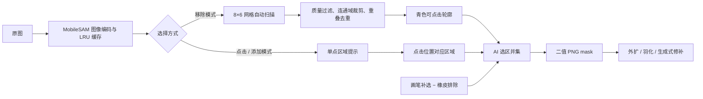

# Floor AI · 地板效果图生成引擎

**在线展示：** [bokiframe.com](https://bokiframe.com)

> 面向**地板行业**的 AI 效果图生成工具：上传地板小样 → 自动识色 + 智能配方 → 配置场景参数 → 调用 Gemini / Fal 图像模型出图，支持 **4K**、快出（B2）与精修（Pro）双模式。
>
> 后端 **FastAPI 无头服务** + 前端 **Next.js**，前后端解耦、异步作业队列、SSE 实时进度。

---

## ✨ 功能特性

- **地板小样识色**：上传地板图，自动分析主色调，驱动后续提示词与配方。
- **智能配方与我的配方**：按色调/风格自动推荐场景搭配，也可保存、更新和删除自己的参数配方。
- **35+ 参数化提示词**：风格、灯光、机位、房型、地区市场等多维选项，组装为高质量英文提示词。
- **多工作流**：纯出图 / 参照图 / 替换 / 宠物友好 / Omakase / 墙板模式等多种生成工作流；Omakase 复用 Gemini Key 生成场景，可配 DeepSeek 自动备用。
- **自由创作**：用户可原样输入中/英文完整指令，按 Slot 1–3 的顺序上传多张参考图，并行交给 B2 / Pro；不经过地板提示词模板。
- **多模型并行**：B2 快出 + Pro 精修，并可启用独立的 SD 3.5 Large 实验线路；多模型可同时选择，统一进入同一任务卡。
- **SD 地板参考与超分**：SD 3.5 使用专属正/负提示词和 InstantX IP-Adapter 强制参考地板小样，约 1MP 扩散后由 AuraSR 交付 2K/4K；超分失败保留基础图并可单独重试。
- **4K 出图**：面向商用提案的高分辨率输出。
- **批量生成**：同一地板批量套用多个房间，或同一参数批量处理多个地板小样。
- **AI 地板局部校色 / 兼容全图校色**：默认由离线 MobileSAM 自动识别地板，可用绿色/红色画笔补选或排除复杂边界；稳健 LAB 算法只修正蒙版内色度、保留地板明暗，墙面与家具逐像素保持原样。旧的框选取样 + 全图校准仍可切换使用。
- **生成式移除（已可用）/添加（实验）+ AI 智能选区**：离线 MobileSAM 自动扫描可移除物件，点击青色轮廓即可多选；添加模式点击地面、墙面或桌面即可取得目标区域。AI 选区可与原有画笔补选、橡皮排除、撤销和清空叠加使用。移除自动适度外扩以覆盖边缘和阴影，添加默认严格限制在选区；任务结果、历史记录、房间图三处入口均可使用。
- **异步作业队列**：`POST` 秒回 `job_id`，`SSE` 推送实时进度；长请求不再被网络中间层 reset。
- **记录复用与对比**：生成入参随记录落盘，可一键复用参数；替换类工作流支持前后拖动对比。
- **记录、评审与导出**：历史记录持久化、收藏、最佳图、评审标签/备注；独立复盘页聚合通过率与好图样本，导出 HTML / 带品牌信息的 PPTX 提案 deck。
- **用量与成本**：统计出图数量、成功率和明细，可按模型配置单价并估算成本。
- **深色模式**：支持浅色、深色和跟随系统主题。

---

## 🧠 AI 智能选区如何工作

AI 智能选区复用了地板校色使用的 **MobileSAM ONNX**，但没有把“识别地板”的业务规则硬搬过来，而是在同一套离线图像编码器之上增加了通用物件扫描与单点区域提示。图片和蒙版均在本机处理，不会为了分割上传到第三方服务，也不会产生分割 API 费用。



具体流程：

1. **本机编码与复用**：源图最长边缩到 1280 像素后进入 MobileSAM；同一图片的编码结果会复用，整图候选另有最近 3 张图片的 LRU 缓存，避免重复打开弹窗时从零扫描。
2. **移除模式自动找物件**：后台在 `8 × 6` 个规则采样点上生成多尺度 mask，按模型置信度、稳定度和面积过滤，再只保留采样点所在连通域；IoU ≥ 0.80 或互相包含 ≥ 0.92 的候选会去重，最终最多展示 24 个青色轮廓。MobileSAM 是通用分割器，因此这里识别的是“可分开的区域”，不会给候选附加椅子、桌子等类别名称。
3. **点击优先，不必等扫描结束**：点中已有轮廓会直接选中/取消；若后台仍在扫描或该位置没有候选，前端立即发送单点识别请求并显示进度。扫描在每个网格点之间释放推理锁，让用户点击优先插队，完成后再把后台候选合并回来。本次 Windows 真机验证中，点击约 **5.1 秒**返回，而完整扫描约 **16.3 秒**完成；实际时间取决于 CPU 和图片内容。
4. **添加模式按区域选择**：点击地面、墙面、桌面等承载区域，模型返回包含该点的最佳稳定区域，作为生成式添加的初始约束；这比自动猜测“要添加到哪里”更可控。
5. **AI 与手绘共同组成最终 mask**：已选 AI 区域先求并集，再叠加画笔补选并减去橡皮排除；移除和添加各自保存独立编辑状态，原有画笔、橡皮、撤销、清空均保留。候选使用按行、从 0 开始交替计数的 RLE 在前后端传输，提交生成时才导出二值 PNG；后端再分别构造供模型推理的 `engine_mask` 和负责无痕合成的 `blend_mask`。
6. **可控降级**：模型缺失、加载失败或没有稳定候选时，界面会提示改用画笔，手绘流程仍可继续；阴影、反射、透明物和被遮挡边缘也可用画笔补选或橡皮排除。AI 选区只决定修改范围，最终增加/移除质量仍由所选生成式修补模型决定。

---

## 🏗️ 架构

```
                 ┌──────────────────────────────────────────────┐
  浏览器  ─────▶ │  Next.js 前端 (web/, :3000)                   │  React 渲染
                 │    └─ api.ts ──HTTP / SSE──┐                  │
                 └────────────────────────────┼─────────────────┘
                                              ▼
                 ┌──────────────────────────────────────────────┐
                 │  FastAPI 无头后端 (:7870, server_api.py 组装)   │  作业队列 / SSE
                 │  业务路由 routes_* · 作业队列 · SSE · 缩略图     │  静态图 / 缩略图
                 └────────────────────────────┬─────────────────┘
                                              ▼
                 ┌──────────────────────────────────────────────┐
                 │  引擎模块（headless）                          │
                 │  提示词组装 · 模型调用 · 识色 · 配方 ·          │
                 │  记录持久化 · 人工评审 · 导出                    │
                 └──────────────────────────────────────────────┘
```

- **前端**只负责渲染与交互，所有业务经 HTTP/SSE 调后端。
- **后端**是唯一服务端，把耗时的出图封装成**异步作业**（秒回 `job_id`，SSE 推进度）。
- **引擎模块**是 headless 的核心逻辑（提示词、模型调用、识色、配方、记录、人工评审、导出），可独立复用。

---

## 🧰 技术栈

| 层 | 技术 |
|---|---|
| 前端 | Next.js 16（App Router + Turbopack）· React 19 · Tailwind v4 · shadcn/ui · lucide · sonner |
| 后端 | Python · FastAPI · Uvicorn · SSE |
| 图像模型 | Google Gemini（image）· Fal（可选） |
| 图像/数据 | Pillow · NumPy · OpenCV · ONNX Runtime / MobileSAM（离线分割）· python-pptx（导出 deck） |

---

## 🚀 快速开始

### 环境要求
- **Python** 3.10+（推荐 3.12）
- **Node.js** 20.9+
- 一个 **Google Gemini API Key**（出图必需；[申请入口](https://aistudio.google.com/apikey)）
- 若你所在网络无法直连 Google，需准备可用**代理**（见 [配置说明](#️-配置说明)）

### 1. 获取代码
后端以 Python 包 `Floor_engine_server` 方式运行，请把仓库克隆为该名字的目录：
```bash
git clone <本仓库地址> Floor_engine_server
cd Floor_engine_server
```

### 2. 安装后端依赖（建议用虚拟环境）
```bash
python -m venv .venv
source .venv/bin/activate          # Windows: .venv\Scripts\activate
pip install -r requirements.txt
# 开发与测试：pip install -r requirements-dev.txt
```

### 3. 安装前端依赖
```bash
cd web && npm install && cd ..
```

### 4. 启动
> 后端需在**仓库目录的上一级**运行（详见 [数据目录](#-数据目录)）。

```bash
# 后端（在 Floor_engine_server 的【上一级】目录）
cd ..
python -m Floor_engine_server.server_api        # → http://127.0.0.1:7870

# 前端（另开一个终端，在 web/ 下）
cd Floor_engine_server/web && npm run dev        # → http://localhost:3000
```

浏览器打开 **http://localhost:3000**。后端健康检查：`GET http://127.0.0.1:7870/api/healthz` → `{"ok":true}`。

首次使用请到前端「**设置**」页填入 Gemini API Key（没有 key 也能打开界面，但无法出图）。

---

## ⚙️ 配置说明

配置存于 `engine_config.json`，可在前端「设置」页可视化编辑，或直接写文件。常用字段：

| 字段 | 说明 |
|---|---|
| `gemini_api_key` | Google Gemini 密钥（出图必需） |
| `fal_api_key` | Fal 密钥（选用 Fal 提供方时需要） |
| `deepseek_api_key` | 可选：Omakase 的 DeepSeek 备用线路 Key |
| `omakase_enabled` | 是否启用 AI 场景代笔（Gemini 主线路） |
| `sd_enabled` | 是否启用 SD 3.5 实验线路（默认关闭，仅纯效果图） |
| `omakase_gemini_model` | Omakase 文本模型，默认 `gemini-2.5-flash` |
| `image_provider` | `google`（默认）或 `fal` |
| `inpaint_provider` 等 | 生成式修补引擎组：提供方（`fal`/`comfyui`）、移除模型 `inpaint_remove_model`、添加模型 `inpaint_add_model`、ComfyUI 地址/超时/自定义 workflow；均可在设置页可视化配置 |
| `proxy` | HTTP 代理，如 `http://127.0.0.1:7897/`；网络无法直连 Google 时填写 |
| `fal_queue_proxy` | SD/AuraSR 队列专用代理；默认留空并忽略系统代理直接连接 FAL |
| `speed_profile` | `fast`（快速失败）/ `resilient`（死磕重试） |
| `auto_failover` | Google 失败时是否自动切到 Fal |
| `tls_verify` / `tls_ca_bundle` | HTTPS 证书校验开关 / 自定义 CA |
| `max_concurrent_per_model` | 每个模型的并发上限 |
| `usage_prices` | 各模型成功出图的单价，用于用量页估算成本 |
| `pptx_company` / `pptx_contact` | PPTX 提案中的公司名与联系方式 |

> ⚠️ `engine_config.json` 含密钥，已被 `.gitignore` 排除，**不会进入版本库**。请勿把密钥提交到仓库。

前端开发默认由 `web/.env.development` 指向 `http://127.0.0.1:7870`；生产静态站由 `web/.env.production` 使用同源 API。
后端可用环境变量：`FLOOR_API_PORT`(7870) / `FLOOR_API_HOST`(仅支持 127.0.0.1) / `FLOOR_API_CORS`（放行的开发前端源）。本版本是客户本机程序，不提供无认证的局域网或公网部署。

### 📁 数据目录
后端会把**配置与运行期数据**写在仓库目录的**上一级**（`config.py` 中 `BASE_DIR = 仓库上级目录`）。因此运行时会在上级目录生成：

| 路径 | 内容 |
|---|---|
| `output_files/` | 出图、每个素材的 `*_记录.json`、优化图、候选图 |
| `output_files/.queue_state.json` | 作业队列及 SD/AuraSR Fal 请求句柄持久化（重启后按原 request 恢复） |
| `engine_config.json` | 密钥与线路配置（含敏感信息，已 gitignore） |
| `custom_recipes.json` | 用户保存的“我的配方”（位于仓库上级，不进入本仓库） |
| `_ng_uploads/logo_*` | PPTX 提案品牌 Logo（由程序上传和清理） |
| `_ng_uploads/` · `_ng_thumbs/` | 上传素材 · 缩略图缓存 |
| `app_local_save.log` | 运行日志 |

把仓库整体挪到别处，`BASE_DIR` 会自动指向新位置，得到**独立**的数据目录，无需改代码。

---

## 📖 使用流程

1. 在「**生成**」页上传一张地板小样（或从最近小样里选）。
2. 系统自动识色；可套用智能推荐，或保存和复用「我的配方」。
3. 选择工作流、市场地区、模型与档位，按需展开高级参数；也可选“自由创作”原样输入指令并上传 1–3 张有序参考图。
4. 点击生成 → 任务进入右侧队列，SSE 实时显示进度；出图后可预览、切换候选和查看前后对比。
5. 对结果可**磨缝 / 二次编辑 / 重抽 / AI 地板局部校色 / 生成式添加与移除**；修补时可点击 AI 识别出的物件或承载区域，也可继续用画笔和橡皮精修蒙版。满意的结果可**收藏**或标为**最佳图**。
6. 到「**记录**」页筛选、复用参数、人工标注**通过 / 备选 / 淘汰**并导出提案；「**评审复盘**」看聚合表现和好图样本，「**用量**」页看数量与估算成本。

---

## 🗂️ 项目结构

```
Floor_engine_server/            # 后端 Python 包（= 本仓库根）
│  ── Web 层 ──
├── server_api.py               # FastAPI app 组装器（lifespan/CORS/静态图/前端挂载 + include_router）
├── routes_*.py                 # 六个业务路由：jobs(队列+生图协程)/previews/library/config/tools/inpaint
├── server_state.py             # 进程内状态：任务注册表 ×3、按模型并发信号量
├── server_schemas.py           # 全部 HTTP 请求模型（前端契约）
├── server_helpers.py           # 路由共享工具：URL 映射、路径守卫、上传落盘
├── image_ops.py / task_registry.py  # 纯 PIL mask 处理 / 泛型任务注册表容器
│  ── 引擎层（headless）──
├── config.py                   # 路径/配置中心（BASE_DIR、engine_config.json 读写）
├── models.py                   # 数据模型：作业、参数、状态
├── prompt_data.py              # 纯数据：选项表（风格/灯光/机位/房型/色调…）+ 中英翻译
├── prompts.py                  # 提示词组装：五阶段流水线（参数 → 英文 prompt + 落 JSON/PNG）
├── image_prep.py               # 小样 ICC→sRGB 预处理 + 识色 analyze_floor_tone
├── sd_prompts.py               # SD 3.5 独立正/负提示词编译器（不改 Gemini 资产）
├── recipes.py                  # 智能配方推荐
├── custom_recipes.py           # “我的配方”运行期 CRUD
├── api.py                      # 外部模型调用（Gemini / Fal / 磨缝二改 / 生成式修补 / 连通测试）
├── color_match.py              # 本地色彩算法（全图兼容模式 / 蒙版内稳健 LAB 色度校正）
├── floor_segmentation.py       # 离线 MobileSAM：地板蒙版、通用物件扫描、单点区域提示与 RLE
├── records.py                  # 记录持久化核心：队列状态、记录 CRUD、收藏/评审
├── usage_stats.py / exports.py / reveal_security.py  # 用量统计 / HTML·PPTX 导出 / 提示词混淆与揭示
├── failure_kb.py               # 失败知识库（错误分类与建议）
├── floor_renderer.py           # 本地地板透视渲染（OpenCV）
├── web/                        # Next.js 前端
├── tests/                      # pytest（golden 提示词 + 69 端点契约快照 + AI 选区 + 安全硬化 + 回归）
└── requirements.txt
```

---

## 🛠️ 开发

深入的开发文档见：

- [`DEVGUIDE.md`](./DEVGUIDE.md)：当前单机版架构、后端端点、前端结构、关键约定与开发工作流。
- [`SAAS_ARCHITECTURE.md`](./SAAS_ARCHITECTURE.md)：未来在线网页订阅版的完整目标架构、计费、任务调度、多供应商容灾与迁移路线。
- [`SD35_INTEGRATION.md`](./SD35_INTEGRATION.md)：SD 3.5 + IP-Adapter + AuraSR 的实现、接口、失败语义与校准说明。

常用命令：
```bash
# 后端测试（当前 186 项）
.venv/bin/python -m pytest

# 前端 lint + 类型/生产构建
cd web && npm run lint && npm run build
```

---

## 📄 许可证

Copyright © 2026 Boki.

本项目的原创代码采用 [GNU Affero General Public License v3.0 only](./LICENSE)
（`AGPL-3.0-only`）授权。AGPL 允许商业使用，但修改、分发或通过网络向用户提供
修改版时，必须遵守 AGPL 对应源码、许可证和修改声明等要求。

如果你希望将本项目用于不遵守 AGPL 的闭源产品或服务，需要向版权所有者申请
[单独的商业许可证](./COMMERCIAL_LICENSING.md)。商业授权请通过本仓库的
[GitHub Issues](https://github.com/Bok1-YY/Floor_engine_Linux/issues) 联系。

MobileSAM 模型资产及其他第三方组件继续遵循各自的许可证，详见
[第三方声明](./THIRD_PARTY_NOTICES.md)。
