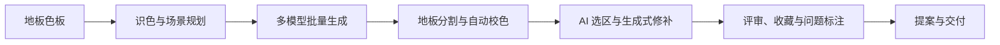
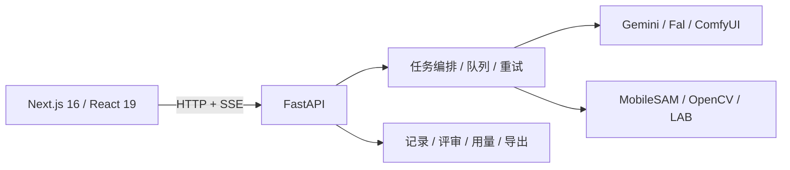

<div align="center">
  

  # Floor Rendering Engine

  **面向地板行业社媒团队的 AI 视觉生产系统**

  把色板、空间构想和提示词工程，变成可批量运行、可校色、可修补、可评审的生产工作流。

  [English](./README.en.md) · [产品案例](./docs/PRODUCT_CASE_STUDY.zh-CN.md) · [在线演示](https://bokiframe.com) · [开发文档](./DEVGUIDE.md)

  [](./LICENSE)
  [](https://www.python.org/)
  [](./web)
  [](./server_api.py)
</div>

<p align="center">
  
</p>

> 这是一个真实投入公司社媒生产的产品，而不是只验证模型调用的 Demo。核心系统由我独立完成产品设计与工程实现；公司及客户信息已脱敏。

## 业务结果

| 指标 | 上线前 | 当前表现 |
|---|---|---|
| 实际使用 | 分散的人工工作流 | 公司社媒组约 **10 人**使用 |
| 生产效率 | 约 **1 小时 / 5 张图**，包含构思、提示词和后处理 | 支持直接批量出图，产能下限主要由上游 API 速度决定 |
| 可用图通过率 | 约 **10 张选 1 张** | 普通图片多数首轮可用；特殊图片平均约 **2 张内**得到可用结果 |
| 综合生产成本 | 多轮生成 + 人工试错 | 内部估算降低约 **80%** |
| 生产规模 | — | 累计生成近 **2,000 张**图片 |
| 业务侧观测 | — | 团队内部月度统计：Pinterest 点赞用户到下单约 **4%** |

<sub>口径说明：成本降幅包含 API 重试、人工构思、提示词编写与后处理时间；Pinterest 指标是团队整体运营结果，受内容、投放、产品和渠道等多因素共同影响，不归因于本系统单一因素。</sub>

## 从“生成图片”到“交付内容”

通用生图工具解决的是单次生成；业务团队需要的是稳定、可控、能复盘的生产闭环。




## 关键产品能力

| 产品环节 | 能力 | 解决的问题 |
|---|---|---|
| 规划 | 色板识色、行业参数、AI 场景代笔、电影感导演规划 | 降低空间想象与提示词门槛 |
| 生产 | B2 / Pro / SD 多线路、批量候选、并发队列、失败重试 | 把一次次手工调用变成稳定产线 |
| 质量 | MobileSAM 地板分割、LAB 自动校色、AI 智能选区、生成式添加/移除 | 保住产品颜色，并快速修正局部瑕疵 |
| 运营 | 记录追踪、通过/备选/淘汰、问题标签、成本统计、HTML/PPTX 导出 | 让团队能评审、复用和交付，而不是散落下载图片 |

### 品牌色不是“后期凭感觉”

模型生成的地板经常出现偏色。系统先用 MobileSAM 找出地板区域，再在 LAB 色彩空间内把结果拉回色板目标，并把修改限制在蒙版内，尽量保留墙面、家具和环境光。


### AI 选区与画笔共同工作

生成式移除会先扫描可分割物件，用户点一下即可选中；生成式添加则以点击位置识别地面、墙面或桌面等承载区域。画笔、橡皮、撤销和清空始终保留，用来补阴影、收窄边缘或在模型不可用时继续工作。


<details>
<summary><strong>AI 智能选区的工作原理</strong></summary>

1. **本机编码**：源图最长边缩到 1280 像素后进入 MobileSAM ONNX；同图 embedding 与最近 3 张整图扫描结果使用 LRU 缓存。分割过程不上传第三方，也不产生额外分割 API 费用。
2. **自动发现候选**：移除模式在 `8 × 6` 网格上做多尺度点提示，按置信度、稳定度和面积过滤，只保留采样点所在连通域；再按 IoU ≥ 0.80 或包含率 ≥ 0.92 去重，最多返回 24 个可点击轮廓。
3. **点击优先**：点中候选可立即切换；未命中或后台仍在扫描时，前端会发起单点分割。扫描在网格点之间释放推理锁，因此显式点击可以优先执行，再与后台候选合并。
4. **可编辑合成**：AI 已选区域先求并集，再叠加画笔补选并减去橡皮排除，最后导出二值 PNG mask。后端分别构造推理蒙版与羽化合成蒙版，修改范围外保持原图。
5. **可控降级**：MobileSAM 找不到稳定区域、反射/透明/遮挡边缘不完整时，界面给出提示并继续允许手绘；选区只约束修改范围，最终内容质量仍由修补模型决定。

实现细节见 [DEVGUIDE：生成式修补智能选区数据流](./DEVGUIDE.md#56-生成式修补智能选区数据流)。

</details>

## 我做了什么

我独立负责了从问题定义到可运行系统的核心工作：

- 访谈并观察社媒生产流程，把“生成好看图片”改写为效率、通过率、品牌色一致性和可交付性的产品目标；
- 设计从色板、场景、生成、校色、修补到评审导出的完整用户旅程；
- 选择并整合 Gemini、Fal、MobileSAM、OpenCV 等能力，同时保留人工控制与失败降级；
- 实现 FastAPI + Next.js 产品、任务编排、数据持久化、用量统计和 Windows 一键启动；
- 根据真实点击“没反应”等反馈完成真机复现、并发锁分析、交互反馈与回归验证。

更完整的背景、取舍、指标口径和迭代过程见[产品案例](./docs/PRODUCT_CASE_STUDY.zh-CN.md)。

## 产品取舍

- **自动化 vs. 控制**：自动给出候选，但不替用户做不可逆决定；所有 AI 蒙版都能手工修正。
- **画质 vs. 吞吐**：不同模型独立并发，普通任务优先批量效率，疑难图允许升级模型或局部修补。
- **品牌一致性 vs. 画面自然度**：只在地板蒙版内做 LAB 校色，并分离推理蒙版与融合蒙版。
- **能力丰富度 vs. 可靠性**：队列、重试、请求句柄和生成记录持久化；模型缺失时保留可工作的基础路径。

## 技术架构



- 前端负责交互，FastAPI 统一业务状态；B2、Pro 和 SD 使用独立并发槽。
- 服务默认只监听 `127.0.0.1`，输出、配置和日志保存在本机数据目录。
- 后端覆盖提示词黄金样本、路由契约、路径安全、队列恢复、校色、智能选区、记录与导出等回归测试。

## 快速开始

要求：Python 3.10+、Node.js 20+；至少配置一个可用图像模型 API。MobileSAM 模型资产已包含在仓库中。

### Windows

```text
start-windows.bat    # 构建后的单端口生产运行，http://127.0.0.1:7870
dev-windows.bat      # FastAPI 7870 + Next.js 3000
```

### Linux / macOS

```bash
python -m venv .venv
source .venv/bin/activate
pip install -r requirements.txt
cd web && npm ci && npm run build && cd ..
python serve.py
```

首次启动后在“设置”页填写 API Key。详细端口、配置与开发流程见 [DEVGUIDE.md](./DEVGUIDE.md)。

## 文档

- [产品案例（中文）](./docs/PRODUCT_CASE_STUDY.zh-CN.md) / [Product case study (English)](./docs/PRODUCT_CASE_STUDY.en.md)
- [开发手册](./DEVGUIDE.md)
- [SaaS 架构路线](./SAAS_ARCHITECTURE.md)
- [第三方组件与模型声明](./THIRD_PARTY_NOTICES.md)
- [商业授权说明](./COMMERCIAL_LICENSING.md)

## 安全与许可证

`engine_config.json`、`data/`、输出图和日志均被忽略；不要在 Issue、截图或日志中公开 API Key。若改造成多人或公网服务，需要先补充身份认证、租户隔离、对象存储和任务调度。

原创代码采用 [GNU AGPL-3.0-only](./LICENSE)。闭源商业使用请参考[商业授权说明](./COMMERCIAL_LICENSING.md)；第三方模型和组件遵循各自许可证。
