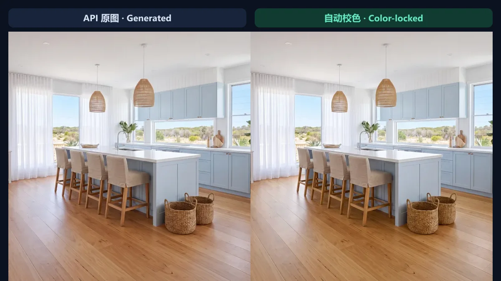
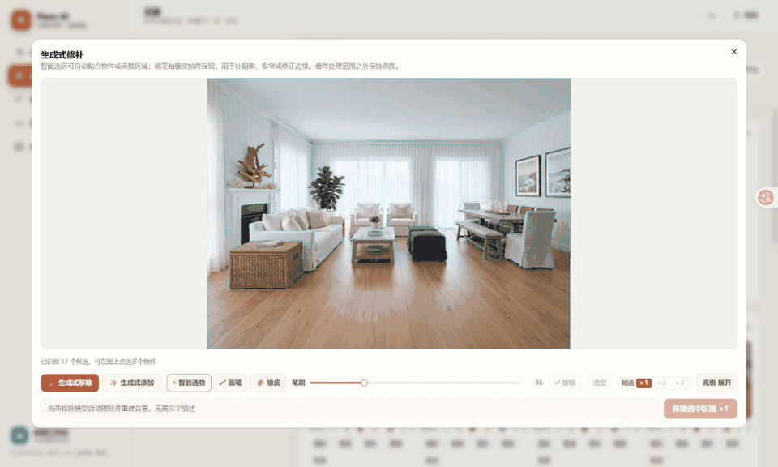
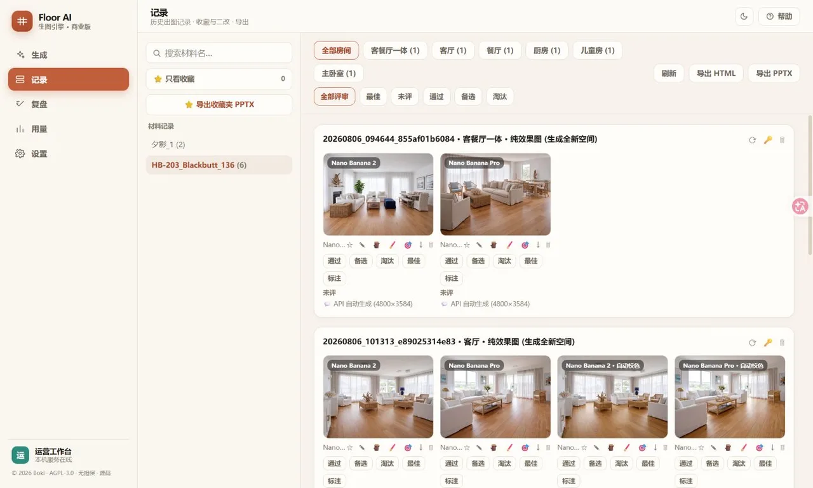

# Floor Rendering Engine: AI Product Case Study

[Back to README](../README.en.md) · [中文](./PRODUCT_CASE_STUDY.zh-CN.md)

## One-line summary

Floor Rendering Engine is an AI visual production system for flooring social media teams. It does more than wrap an image-generation API: it connects swatch understanding, scene planning, batch generation, color control, local editing, review, and delivery into an operational workflow.

> Status: used in a real corporate social content workflow. I independently completed the core product design and engineering. Company, customer, and commercial information is anonymized or expressed as ranges.

## 1. Context and users

The primary users are approximately 10 members of a corporate social media team producing interior scenes for flooring products across channels such as Pinterest.

The old task looked like “generate five images,” but actually required:

1. Understanding which spaces fit a flat product swatch;
2. Imagining the room, furniture, lighting, and installation pattern;
3. Writing and repeatedly tuning prompts;
4. Calling a model multiple times and selecting roughly 1 usable image from 10;
5. Correcting product color, local artifacts, and composition;
6. Downloading, naming, reviewing, and delivering assets.

The end-to-end process took about one hour for five images. The bottleneck was not only generation latency, but the cognitive work and rework around the model.

## 2. Problem definition

I reframed “build a flooring renderer” into four product outcomes:

| Outcome | Product question |
|---|---|
| Lower creative barrier | Can people without prompting or spatial-visualization expertise produce consistently? |
| Raise usable-image rate | Can we reduce the gap between many outputs and very few deliverables? |
| Protect product truth | Can color, plank format, installation, bevel, and finish stay close to the real product? |
| Complete the workflow | Can users edit, review, measure, and deliver after generation? |

The resulting north-star concept is not model calls per day, but **deliverable images per unit of production time**.

## 3. Product strategy

### 3.1 Turn domain knowledge into parameters, not long prompts

Users start from a swatch and select room, installation, plank width, bevel, gap, gloss, and human/pet options. The system compiles these structured choices into model prompts, while an AI scene copilot can complete composition and narrative.

This converts prompting from individual craft into a reusable team capability.

### 3.2 Use multiple models and batches to manage uncertainty

A task can run B2, Pro, or an experimental SD route concurrently. Each route has independent concurrency, with retries, failover, and persisted provider handles. Users receive a sourced candidate set instead of babysitting individual calls.

### 3.3 Design brand color consistency into the workflow

Prompting alone cannot reliably preserve flooring color. MobileSAM first segments the floor, then LAB-space matching moves it toward the swatch target. The correction remains inside the mask to avoid shifting walls, furniture, and ambient light.

### 3.4 Combine an AI first draft with human control

Generative add/remove supports both AI smart selection and the traditional brush. Automatic scanning quickly selects furniture; point segmentation identifies a floor, wall, or tabletop. Brush and eraser handle shadows, occlusion, and fine edges.

The design neither assumes the model is always correct nor traps the user when it fails.

### 3.5 Bring outputs into an operational loop

The system preserves relationships among tasks, model routes, originals, automatically color-matched variants, and manually edited variants. It adds pass/alternative/reject/best decisions, issue tags, usage estimates, and HTML/PPTX export.

## 4. Key iterations

| Stage | User problem | Product change |
|---|---|---|
| Prototype | Every task starts with new ideation and prompting | Structured domain parameters and scene templates |
| Batch production | Calls are slow and failures require manual restarts | Multi-model concurrency, candidate batches, queue, and retry |
| Quality control | A visually pleasing floor may not represent the product | MobileSAM floor mask plus LAB color matching |
| Local edits | Removing artifacts requires slow brush work | Object scan, point segmentation, generative add/remove |
| Real feedback | Clicking smart selection appears to do nothing | Immediate status, point-request priority, segmented scan locking |
| Team operations | Assets are scattered and hard to analyze | Records, review, tags, usage, and proposal export |

### How “clicking does nothing” changed the implementation

The first smart-selection version passed model and route tests. In a real browser, however, a click that missed a candidate returned silently, while the full scan held the inference lock long enough to queue point segmentation behind it.

After reproducing the issue on an isolated port, I made three changes:

1. Every miss immediately shows a recognition state instead of returning silently;
2. Automatic scanning releases the shared lock between grid points, giving an explicit click priority;
3. Point results merge with later background candidates without overwriting the user's selection.

The lesson: AI product quality includes whether waiting is legible, failure is recoverable, and explicit user intent receives priority—not only model accuracy.

## 5. Outcomes and definitions

| Outcome | Current observation | Definition |
|---|---|---|
| Real users | Approximately 10 | Active members of the corporate social media team |
| Efficiency | From about 1 hour / 5 images to direct batch production | Old time includes ideation, prompting, and post-processing; current floor is mainly upstream API speed |
| Usable-image rate | Most standard images usable on the first round; special cases average within about 2 outputs | Compared with the team's earlier experience of selecting roughly 1 from 10 |
| Cost | Approximately 80% lower | Internal estimate including API retries and labor time |
| Scale | Nearly 2,000 images | Cumulative system-generated output |
| Channel metric | Approximately 4% monthly Pinterest like-to-order conversion | Internal team reporting; a combined operating outcome, not single-product causal attribution |

These figures are not a randomized controlled experiment. They are strong evidence of workflow improvement, but insufficient to claim that the system alone caused every downstream sale.

## 6. My responsibilities

I independently drove the project's core work, including:

- Workflow observation, problem decomposition, outcome definition, and prioritization;
- Information architecture, key interactions, controlled fallback, and metric design;
- Prompt compilation, multi-model routing, queue recovery, records, and export;
- MobileSAM segmentation, LAB matching, smart selection, and generative-edit integration;
- FastAPI backend, Next.js frontend, Windows startup, and local data architecture;
- Unit/contract testing, real-browser verification, documentation, and iteration reviews.

## 7. Limitations and next steps

- **Measurement infrastructure:** replace manual reporting with privacy-conscious events for first-round acceptance, active labor time per image, retries, and channel asset IDs.
- **Experiment design:** stratify comparisons by scene template, model route, and correction strength instead of relying only on overall averages.
- **Team deployment:** the default is a local single-user app; multi-user SaaS requires authentication, tenant isolation, object storage, a job service, and auditing.
- **Segmentation boundaries:** transparent, reflective, thin, or heavily occluded objects may still need the brush; semantic labels and correction feedback are logical next steps.
- **Business attribution:** connect exported asset IDs to Pinterest publishing and orders before estimating incremental conversion impact.

## 8. Technical evidence

- FastAPI + SSE provides task state; Next.js 16 / React 19 powers the workstation;
- MobileSAM ONNX runs locally, OpenCV handles components and masks, and LAB matching applies local color correction;
- Path guards, persisted tasks/records, independent model concurrency, retry, and recovery support production reliability;
- Regression coverage includes prompt snapshots, API contracts, path security, color matching, smart selection, queue recovery, records, and export.

Further reading: [Developer guide](../DEVGUIDE.md) · [SaaS architecture roadmap](../SAAS_ARCHITECTURE.md)
